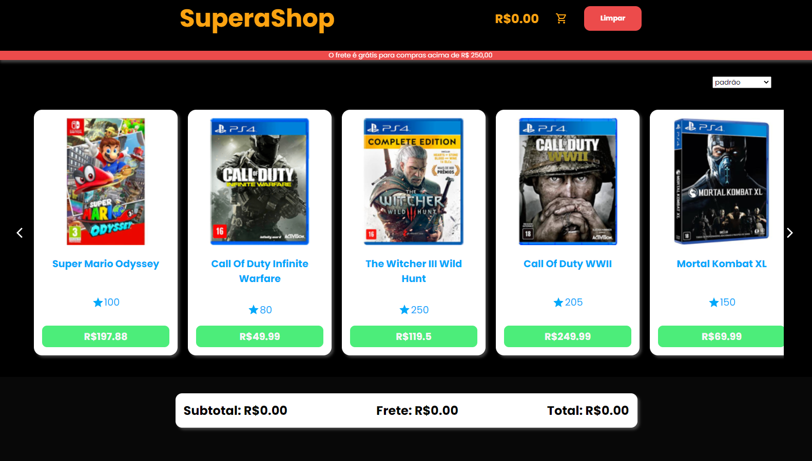

<h2 align="center" style="color:#FaC311;font-size:2rem;font-weight:700;">SuperaShop</h2>

SuperaShop é um e-commerce de venda de jogos para console.



## Tecnologias utilizadas:


## Como rodar o projeto

Clone esse projeto e acesse a pasta.

```bash
$ git clone https://github.com/pedrolucazx/Desafio-Supera.git
$ cd Desafio-Supera
```
Para iniciá-lo, siga os passos abaixo:
```bash
# Instalar as dependências
$ yarn
# Iniciar o projeto
$ yarn dev
```


## Autor
- Linkedin - [Pedro Lucas](https://www.linkedin.com/in/pedrolucazx/)
- GitHub - [pedrolucazx](https://github.com/pedrolucazx)